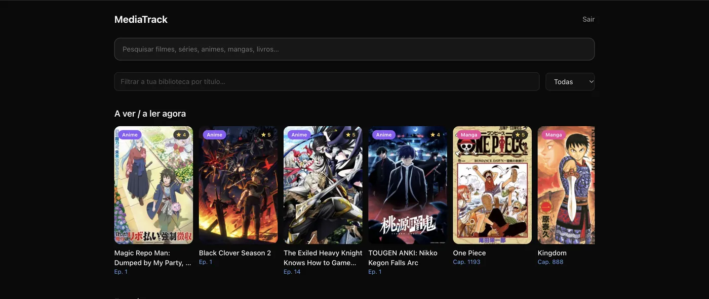
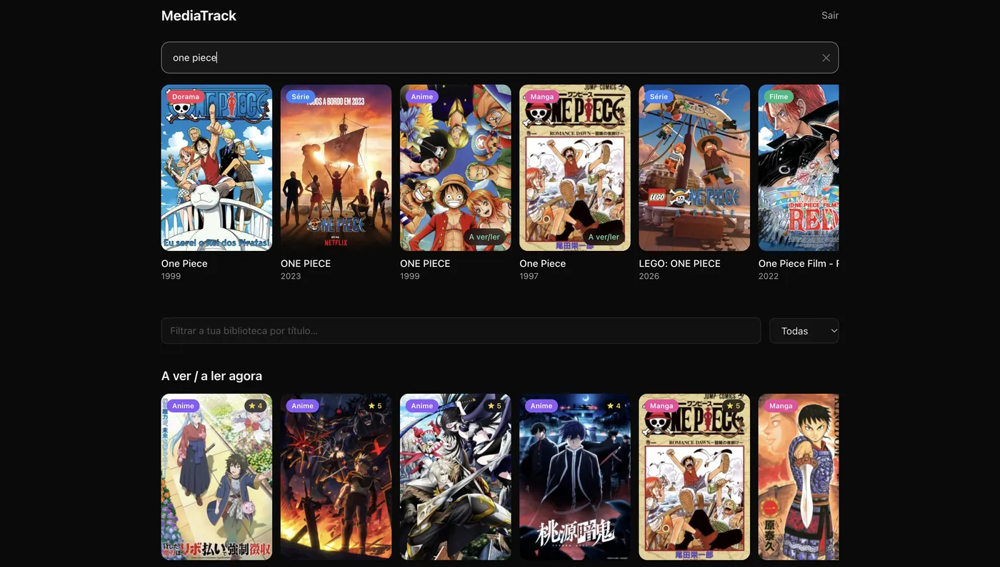
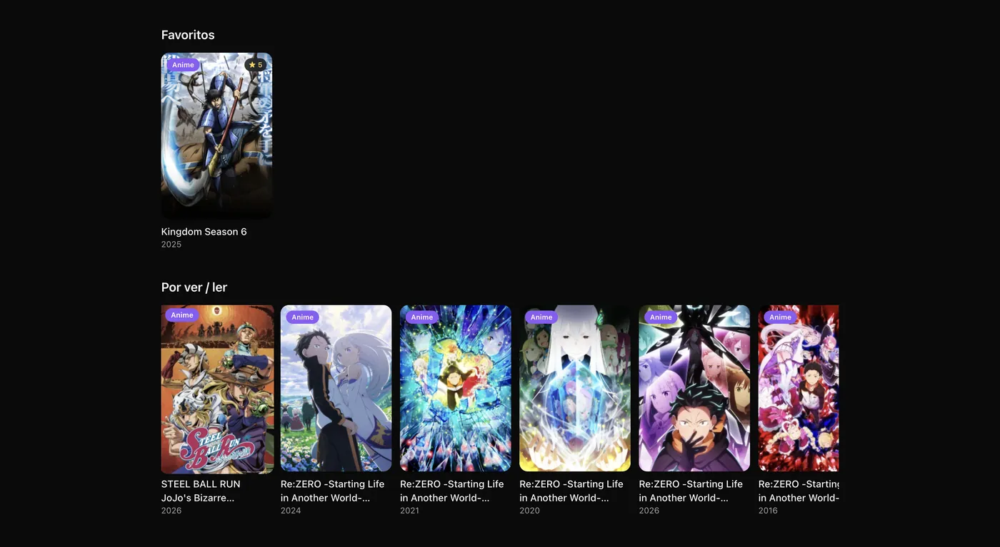
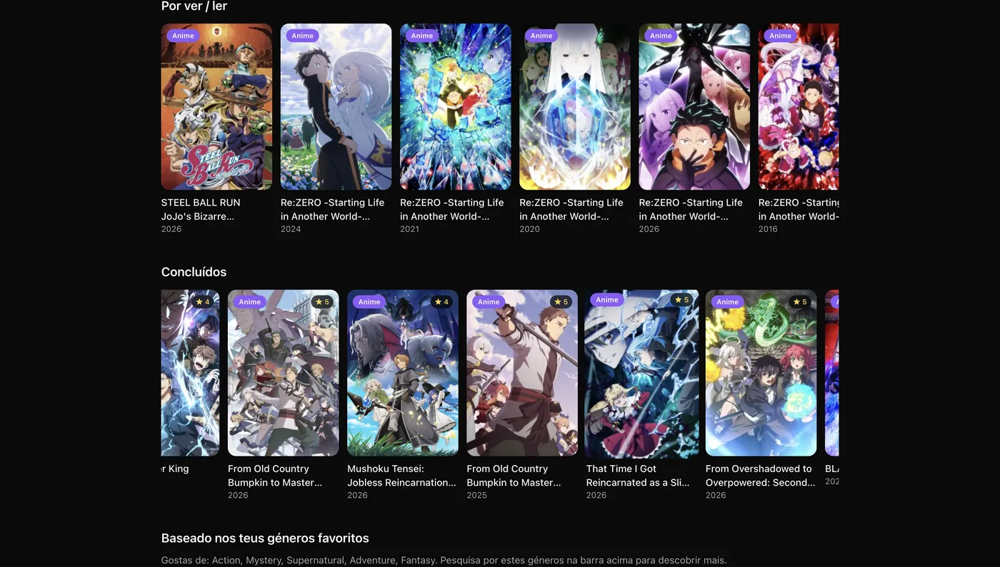
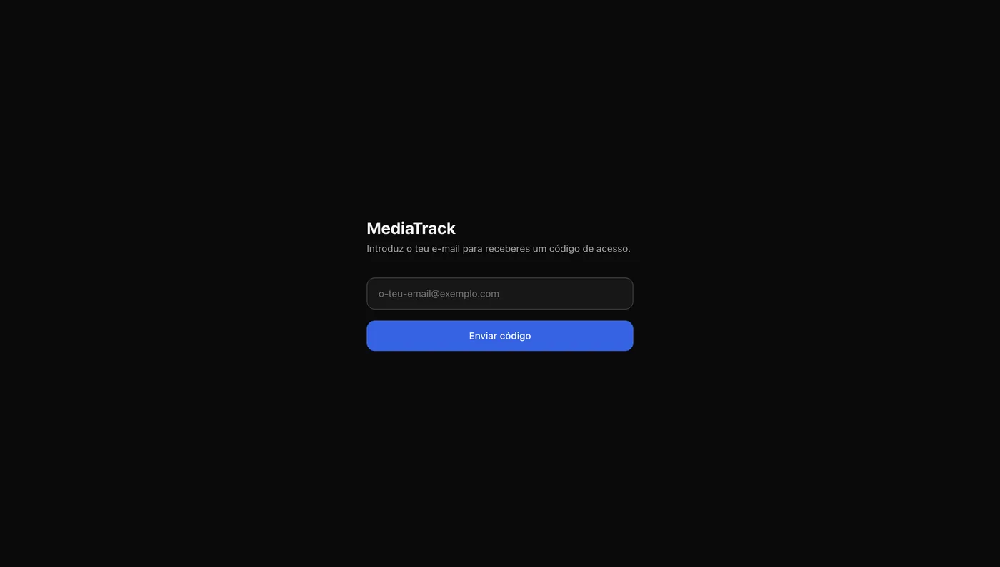
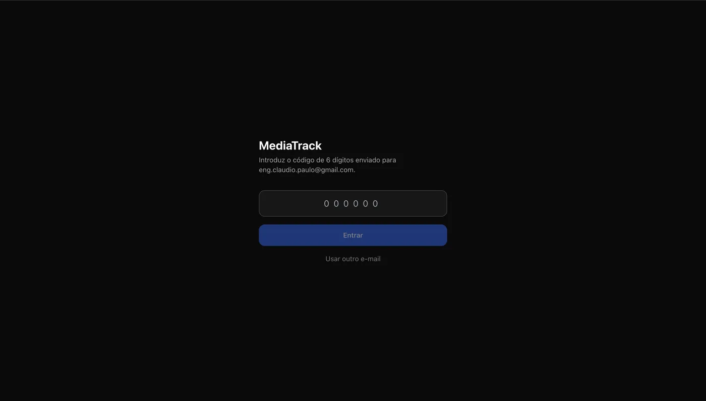

**English** | [Português](README.pt-PT.md)

# MediaTrack

Track movies, TV series, K-dramas, anime, manga and books in one place. MediaTrack combines three public catalogues into a single search, keeps a personal library by status, and runs as a responsive web app, an installable PWA, and a native iOS/Android app.

## Screenshots

The app interface is in European Portuguese.

| Dashboard | Search across all catalogues |
| --- | --- |
|  |  |

| Library: favorites and backlog | Library: completed and recommendations |
| --- | --- |
|  |  |

| Passwordless sign-in | Enter the 6-digit code |
| --- | --- |
|  |  |

## Features

- **Unified search** across TMDB (movies, TV, dramas), AniList (anime, manga) and Open Library (books), queried in parallel and normalized into one data model.
- **Personal library** with statuses (watching/reading, completed, backlog, favorite), 1 to 5 star ratings and notes.
- **Automatic completion**: when your progress reaches the known total (for example episode 24 of 24), the item moves to "Completed".
- **Recommendations** based on the genres of your completed and favorite items.
- **Passwordless sign-in** with an email one-time code (Supabase Auth, 30-day sessions).
- **Native mobile app** via Capacitor: encrypted session storage, Face ID / fingerprint / PIN app lock, offline library cache and local reminders.
- **Data isolation**: PostgreSQL Row Level Security so each user can only read and write their own library and reviews.

## Tech stack

| Area | Technology |
| --- | --- |
| Frontend | Next.js 14 (static export), React 18, TypeScript, Tailwind CSS |
| Backend | Supabase (PostgreSQL, Auth, Row Level Security) |
| Mobile | Capacitor 8 (iOS and Android), secure storage, biometrics, local notifications |
| External APIs | TMDB, AniList (GraphQL), Open Library |
| CI/CD | GitHub Actions: Supabase keep-alive ping, iOS build and TestFlight upload |

## Getting started

**Requirements:** Node.js 18.18+, a free [Supabase](https://supabase.com) project and a free [TMDB](https://www.themoviedb.org) account.

1. **Create the database.** In the Supabase SQL Editor, run `supabase/schema.sql`. It creates the tables, enums, RLS policies and the profile trigger.
2. **Enable email auth.** In Authentication > Providers > Email, keep "Confirm email" and OTP enabled. Optionally set the session length to 30 days.
3. **Get your keys.** Copy the Project URL and `anon` key from Project Settings > API, and the "API Read Access Token" from your TMDB account settings. AniList and Open Library need no key.
4. **Configure and run.**

```bash
cp .env.example .env.local   # fill in the three values
npm install
npm run dev                  # http://localhost:3000
```

To test on a phone on the same Wi-Fi, open `http://<your-local-ip>:3000`, then use "Add to Home Screen" to install it as a PWA.

## Project structure

```
mediatrack/
├── supabase/schema.sql        # tables, enums, RLS policies, triggers
├── app/
│   ├── login/                 # email + OTP sign-in
│   ├── auth/callback/         # auth callback route
│   └── dashboard/             # main screen
├── components/                # SearchBar, MediaCard, Carousel, StarRating,
│                              # MediaDetailsModal, AuthGate, AppLockGate, OfflineBanner
├── lib/
│   ├── api/                   # tmdb, anilist, openLibrary, unified search, library CRUD
│   ├── supabase/              # Supabase client
│   └── mobile/                # secure storage, offline cache, notifications
├── hooks/useDebounce.ts
├── docs/store/                # app store submission guide and listing copy (Portuguese)
└── .github/workflows/         # ci, supabase-keepalive, ios-testflight
```

## Deployment

`npm run build` produces a static site in `out/`, so it can be hosted on any static host (Vercel, Netlify, Cloudflare Pages, GitHub Pages). Set the three `NEXT_PUBLIC_*` variables in your host's dashboard.

## Mobile app

```bash
npm run mobile:build          # static build + cap sync
npm run mobile:open:android   # open in Android Studio
npm run mobile:open:ios       # open in Xcode (macOS only)
npm run mobile:icons          # regenerate icons and splash from assets/icon-source.svg
```

Store submission steps are in [docs/store/STORE_SUBMISSION_GUIDE.md](./docs/store/STORE_SUBMISSION_GUIDE.md) (Portuguese). The privacy policy is available in [English](./PRIVACY_POLICY.md) and [Portuguese](./PRIVACY_POLICY.pt-PT.md).

## Keeping the free Supabase tier alive

Supabase pauses free projects after 7 days without API requests. The workflow `.github/workflows/supabase-keepalive.yml` calls a harmless `keepalive_ping()` function every 3 days. To enable it, add `SUPABASE_URL` and `SUPABASE_ANON_KEY` as repository secrets (Settings > Secrets and variables > Actions). This prevents pausing; it is not a backup.

## Notes

- **Security:** every user only accesses their own library and reviews. `media_items` is a shared read-only cache for authenticated users.
- **Rate limits:** TMDB and AniList limits are generous for normal use; add server-side caching if you scale to many concurrent users.
- **Language:** the app interface is currently in European Portuguese.

## License

[MIT](./LICENSE)

## Author

Built by [Claudio Paulo](https://github.com/ClaudioPaulo), software engineer based in Lisbon.
